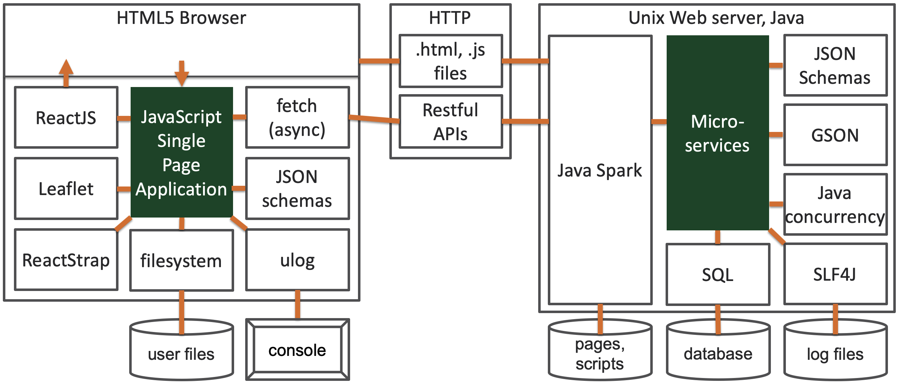
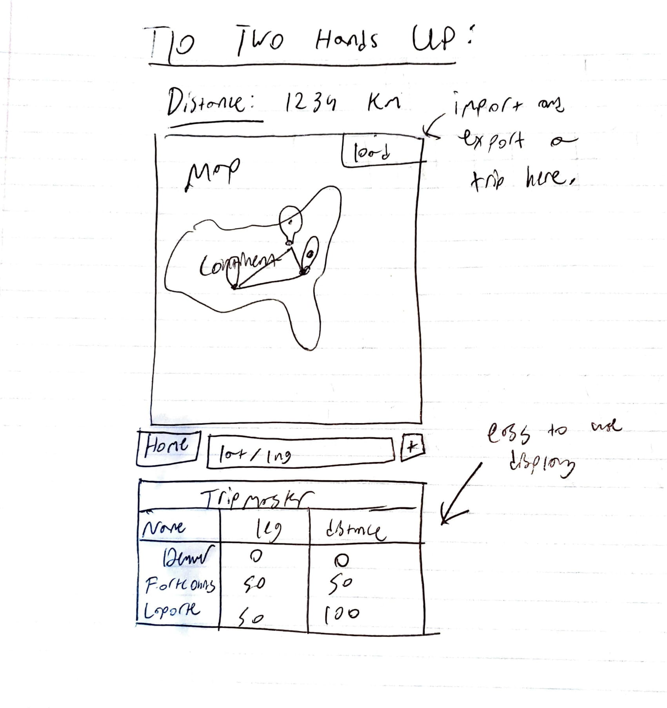

# Introduction

This document describes the architecture and design of a single page web application that interacts with microservices via RESTful APIs.
The key elements in this document include the architecture, user interface, client components, and server classes.

This is a living document that is updated as changes are made each sprint.
The initial document describes the Base code students are given as a starting point for the semester.
Students are expected to update this document as changes are made each sprint to reflect the evolution of their application and key decisions they make.
The Base section serves as an example.

# Base

The Base is a simple application to provide the architecture to the students at the beginning of the semester.
The JavaScript code will be useful examples for students to learn from and leverage in the code they write for sprint 1.
The progressive display of information using collapsible sections and popups will serve as examples of good user interface design.
The overall design is somewhat minimalist/simple for the intended mobile device audience.

### Architecture

The Base architecture is a JavaScript single page web application in an HTML5 browser that uses RESTful APIs to access Micro-services provided by a Java server running on Linux.
The client consists of a minimal index.html file that loads and executes the bundled JavaScript application.
The client and server files are bundled into a single JAR file for execution on the Linux server at a specified port.
The browser fetches the client files from the server on the specified port.

The browser loads the index.html file (by default) which in turn loads the bundled JavaScript single page application bundle.js.
* The single page application makes RESTful API requests to the server on the same port using  JavaScript's asynchronous fetch.  
* A protocol document describes the JSON format for the RESTful API requests and responses.
* JSON Schemas are used to verify requests on the server side and responses on the client side.
* On the client, ReactJS renders the application using ReactStrap, Leaflet, and application defined components.
* GSON is used on the server to convert JSON requests to Java objects and Java objects to JSON responses.
* The client (ulog) and server (SLF4J) logging mechanisms control debugging output during development and production - print statements and console logging should never be used. 

The following architecture elements are not included in the Base system.
They will be added later in the semester.
* Client filesystem .
* Server SQL .
* Server concurrency.

### User Interface

The basic screen in black shows the view on a mobile device, with a header, footer, and map.
The header contains a earth logo and the team name obtained from the server when the client was loaded.
The footer contains a connection icon along with the current server name and server URL the client is connected to.
The blue areas highlight the actions that may be performed.

Rather than buttons or icons to signify actions, we are associating actions with elements that are already on the screen to reduce the clutter.
We are using both popups and collapsible sections in this design rather than choosing to use one exclusively.
* Collapsible/Hidden sections are used for the map and about sections since they have a significant amount of content and we don't need to see them at the same time.
* A popup is used for the URL change since we want to control the interaction until the operation is completed. It seemed more natural than another collapsible section.

#### Clicking on the map places a marker.
Whenever a user clicks on the map, the client should display a marker with latitude and longitude at that location.
We only maintain a single marker at this point displaying the most recently clicked location.

#### Clicking on the team name should tell me more about the team.
Whenever a user clicks the team name in the header, a collapsible section should appear under the header with information about the team.
The collapsible map should disappear so only the about or map are displayed.
A close button / icon in the top right corner of the about will close the about and return the map to display.
A simple toggle in state should be able to control this rendering.
The about page should contain the team name as a heading, but be otherwise blank in base. 

#### Clicking on the URL in the footer should let me change the server.
Whenever a user clicks on the URL a popup should open showing the team name, the URL in an input text box, and a Cancel button.
When the user modifies the URL, a Test button should appear and the server name should disappear.
When the Test button is clicked, it will attempt to connect to the server.
If not successful, nothing changes and the user may continue to make URL changes or click the Cancel button to return to the original sever (it shouldn't change).
If successful, the new server name should appear and a Save button should replace the Test button.
When the user clicks the Save button, the server connection should change and the popup closes, revealing the new servername and URL in the footer.

### Component Hierarchy
The component hierarchy for the base application depicted below shows the our top level App component with four children components.
* App renders the major components on the screen.
* Header renders an icon and a team name in the top banner.
* Footer renders the current server connection in the bottom footer.
* Atlas renders a map.
* About renders information about the team.

We do not show the many ReactStrap components in this hierarchy, even though they will appear when you are debugging on the client.

### Class Diagram
The class diagram for the base application depicted below shows the basic structure of the web server application.

The classes in blue represent the classes specific to this application.  
* WebApplication processes command line parameters and creates MicroServer.
* MicroServer start a web server on the given port, configures the server for security, static files, and APIs for different types of requests, and processes the requests as they arrive.
* JSONValidator verifies a request is properly formatted before attempting to process it using JSON Schemas.
* RequestConfig is a specific request that allows the server to respond with its configuration to allow interoperability between clients and servers. 
* RequestHeader defines the basic components of all requests.

The classes in orange represent the external libraries used by the application.
Often there are several related classes but we've listed only one to simplify the diagram.
* GSON converts a JSON string into a Java object instance.
* Spark provides the necessary web support for our MicroServer.
* JSON provides libraries to manipulate JSON objects using the JSON Schema libraries.
* Logger provides a centralized logging facility used in all of the application classes.

# Sprint 1

TOP SECTION:
* Represents our home page, with displayed map and home button features as needed. 
* HOME button must be React, not HTML styled.
* Zoom feature and centered not mandatory, but preferred.

BOTTOM SECTION: 
* Represents the about page, with included individual biographies.
* Using Cards, and card bodies with associated images as necessary.
* Using individual images, not extra group images.

# Sprint 2

FEATURES: 
*Our updated map is going to support the addition of as many markers as you wish. Developing for mobile means 
we must keep a minimal UI in mind. Our markers will add with notifications, not creating a growing list as to minimize
spacial issuie's. Alot of technical background is going to be nessecary to create the advanced UI, and we will be 
first focusing on functionality, adding a UI layer later.

**LATITUDE LONGITUDE BOX:** We will be using a single input box, formatted for input using Coordinate Parser package
referenced in the included documentation. 

**ADDITION BUTTON:** We will be using a manual click + button on the right bottom edge. This button will ensure that while
the verification is with every keystroke, the marker will not, making it easier to enter a location and not have things 
buzzing around the screen. 

**DISTANCE DISPLAY:** We will be using a basic display above the map, as we are worried about the time constraints required
for making a pop up along the drawn line. We have decided that a simple but functional display is the best possible option.
We hope that if, given the chance, we can update our distance display to be more efficient and easier to read.

**LINE:** Keeping in mind people of different visual capabilities, we will make sure that the line is drawn in a complimentary
color, so that it is especially easy to see on the map. The line will connect two markers of the same color, we may implement
other colors if time permits.

# Sprint 3

**FEATURES:**
Our new and updated design will implement a variety of new features as instructed by SPRINT 3. These will be implemented
over various epics detailed below. We will be adding a small button in the upper right corner of the map, which will allow
for loading and saving various files. The bottom section will consist of all destinations, note that if the destinations 
are expansive, the user will have to scroll. We will make sure the total trip distance is displayed at the top as it was 
last sprint. 

**User Story:** As a high profile travel agency, we create a lot of trips. We need an efficient and fast design 
that allows us to input large trips and respond with the correct distances as necessary. Our patrons would like to know
the farthest individual distances they may be traveling, and the total mileage of the trip is a fun way to inspire our
guests. 

**Tripmaster Trip and Distance Table**
This will be implemented in the Tripmaster box shown above. Using airport style departure/arrival itineraries, we 
will show each leg of the journey and then show the total cumulative distance. The total distance will also be shown
at the top for added convenience. 

**User Story:**
One of our newest features for added travel accessibility is allowing our clients to tour on their own time! Want to 
go checkout the local bar? Add it! Want to go to a neighboring country? No problem, as you can easily update your trip
in the tripmaster, with updating live displays as you enter more destinations. (Destination wrapping is included in classic
Mario style edge warping).

**Tripmaster Destination and Modification:** 
The tripmaster will be highly modifiable, allowing you to enter new points into both the map and table, featuring appropriate
scaling as needed. Users may also click on the map to add markers if preferred. 

**User Story:** 
Most of all, our clients prefer that HAPPY TOURS USA has the number one in friendly user interfaces. You may add and delete 
destinations at will, create unique memories, and least of all worry about having a hard time navigating to your destination. 

**Tripmaster GUI Behavior and File Loading:** 
This will likely be the hardest part of the design. A user should be able to intuitively click and drag on their individual
locations to arrange and place each location in an ideal order. A big part of this will be modularizing each location. If 
this is not possible, we will make sure that users are capable of adding and deleting markers, and resizing the map respectively. 
Last but not least, the tripmaster will allow you to load various file types in case of premade tours. The files can then be
saved and exported from our map in the specified format. 

**Client State and Props Hierarchy:**

App.js -> Atlas.js (Passing Props: Server Port, Distance) 

States: Server Port is set in App.js, but is used within atlas to set and call other states. 

Distance is set in Atlas.js, and called by using the server request with body to successfully calculate and return the state value.
# Sprint 4 

**Client Component Hierarchy and design with save button pictured above**

**FEATURES:**
Our new and updated design will implement a variety of new features as instructed by SPRINT 3, and continued in SPRINT 4.
These will be implemented over the various epics detailed below. In addition to updating our itinerary behavior for 
optimal mobile user friendliness, we will also be adding a basic save button below the itinerary. 

**Server Class Diagram pictured above**

**LOAD:**
**User Story -**
One of our newest features for added travel accessibility is allowing our clients to tour on their own time! Want to 
go checkout the local bar? Add it! Want to go to a neighboring country? No problem, as you can easily update your trip
in the itinerary, with updating live displays as you enter more destinations. (Destination wrapping is included in classic
Mario style edge warping). This will include being able to upload files of types CSV and JSON into our itinerary. 

**SAVE:**
Saving will also be implemented, allowing our clients to export their trips in KML or SVG Map formats, and CSV or JSON 
for the itinerary. The client will be able to select their trips individually and save them for later use. That exported
file should be able to then be reloaded into the website. 

Both of these types will make use of our newly included trip request type, and by click the button on the top of the 
itinerary for load, and below for save, the client can easily and efficiently import and export data. 

**OPTIMIZATION:**
Some of the biggest changes will be done behind the scenes, increasing user load time and ease of use. We will be optimizing
our calculations to give the most efficient path possible on their trip. We also make sure that information relayed will
be exceptionally quick in response, to avoid client frustration. 

# Sprint 5
